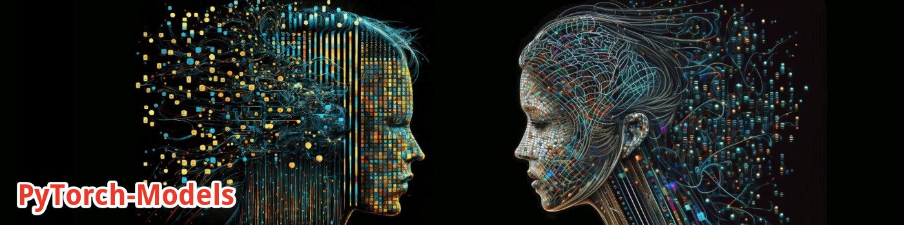

--------------------------------------------------------------------------------

 

# PyTorch-Models
A collection of machine learning models implemented from various sources (primarily arXiv papers).

# PyTorch Image Models
- [Introduction](#introduction)
- [Models](#models)
- [Training framework](#framework)
- [License](#license)

## Introduction

Welcome to **PyTorch-Models**, a Python library with a collection of machine learning models I implemented for as my personal data science and machine learning toolbox.
It stands on the work of many others. I strive after acknowledging all source materials via proper citation (link to github, arXiv, etc).

## Models

## Training framework

Along with regular training, validation and inference schema, [PyTorch Lightning](https://lightning.ai) is to be used as well.

## License

The MIT License (MIT). Please see the [license file](https://github.com/SergeySakharovskiy/PyTorch-Models/blob/main/LICENSE) for more information.
